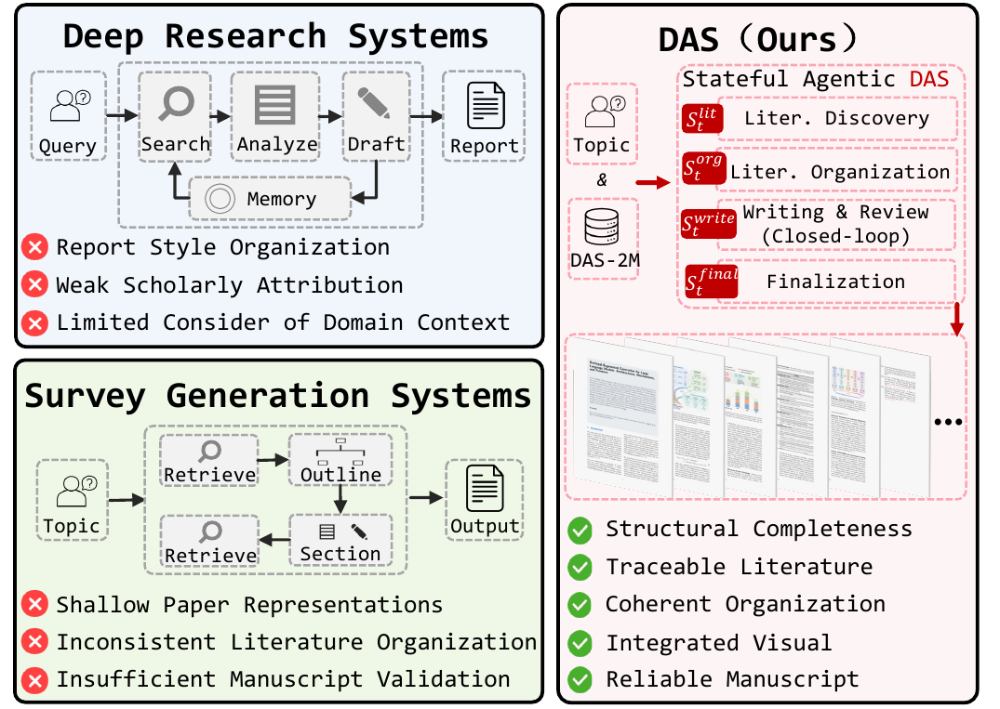
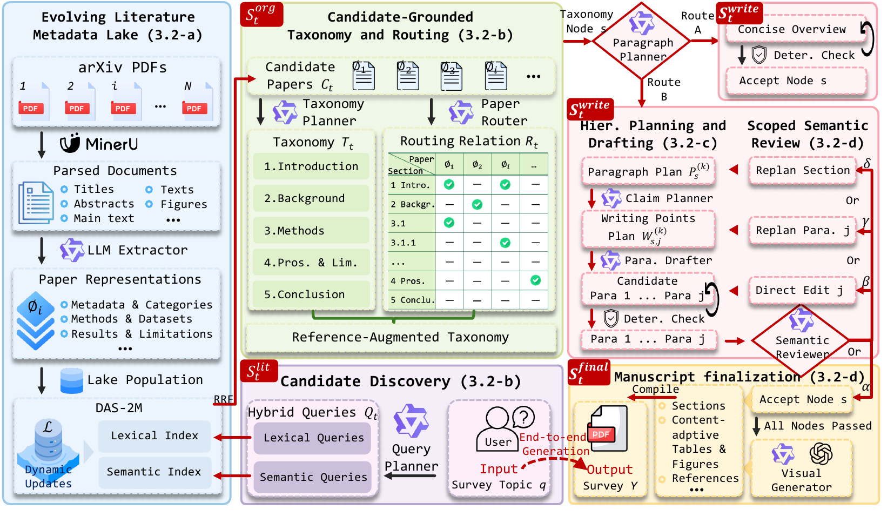

<div align="center">


[Zhikai Xu](https://github.com/ZhikaiXu24)<sup>1,&#42;</sup> · [Zhucun Xue](https://scholar.google.com/citations?hl=zh-CN&user=m3KDreEAAAAJ)<sup>1,&#42;</sup> · [Teng Hu](https://sjtuplayer.github.io/)<sup>2</sup> · [Yabiao Wang](https://scholar.google.com.hk/citations?hl=zh-CN&user=xiK4nFUAAAAJ)<sup>1</sup> · [Yong Liu](https://scholar.google.com/citations?user=qYcgBbEAAAAJ)<sup>1</sup> · [Jiangning Zhang](https://zhangzjn.github.io/)<sup>1,†</sup>

<sup>1</sup>Zhejiang University &nbsp;&nbsp; <sup>2</sup>Shanghai Jiao Tong University<br />
<sup>&#42;</sup>Equal contribution &nbsp;&nbsp; <sup>†</sup>Corresponding author


<a href="https://huggingface.co/datasets/ZhikaiXu24/DAS-2M"></a>
<a href="https://zhikaixu24.github.io/projects/DAS/"></a>

[Overview](#-overview) · [Release](#-release) · [DAS-Method](#-das-method) · [DAS-2M](#-das-2m) · [Surveys by DAS](#-surveys-by-das) · [DAS-Bench](#-das-bench) · [Installation](#-installation) · [Citation](#-citation)

</div>

## 🔥 Continuous Updates

- ✅ **[2026-08-14]** 220 surveys generated by DAS were released.
- ✅ **[2026-08-08]** DAS-2M was released.
- ✅ **[2026-08-08]** DAS-Bench and its evaluation toolkit were released.
- ⏳ **DAS method code:** To be released.

The arXiv badge will be activated when the public paper link becomes available.

## 🔭 Overview

**Deep Academic Survey (DAS)** is the first framework for **publication-oriented academic survey generation**, designed to construct survey manuscripts with **structural completeness, traceable literature support, coherent organization across taxonomy, section, and paragraph levels, integrated visual elements, and consistency among final manuscript artifacts**. To achieve this, DAS formulates survey generation as **stateful manuscript construction**, separating reusable paper understanding maintained in a dynamically updated literature metadata lake from topic-specific **organization, drafting, review, and finalization**.

<p align="center">
  
</p>

## ✨ Highlights

- **DAS:** A stateful agentic framework for **publication-oriented academic survey generation**, connecting literature discovery, organization, citation-grounded writing, closed-loop review, and manuscript finalization in one end-to-end workflow.
- **DAS-2M:** A persistent and dynamically updated literature metadata lake that provides reusable, **survey-oriented representations** of approximately **2 million papers**.
- **DAS-Bench:** A **30-topic multi-domain benchmark** for academic survey generation, paired with **DAS-Eval**, a 16-criterion evaluation suite designed specifically for **publication-oriented academic surveys**, covering scholarly citation, taxonomic synthesis, hierarchical discourse, and manuscript reliability.

## 📦 Release

| Component | Status | Contents |
|---|---|---|
| [`DAS/`](DAS/) | ⏳ To be released | Core DAS method implementation and generation pipeline. |
| [`DAS-Bench/`](DAS-Bench/) | ✅ Released | Benchmark specification, topics, evaluation code, results, and qualitative materials. |
| [DAS-2M](https://huggingface.co/datasets/ZhikaiXu24/DAS-2M) | ✅ Released | Persistent and dynamically updated literature metadata lake distributed through Hugging Face. |

## 🧭 DAS-Method

**DAS performs stateful agentic construction over a shared manuscript state**, coordinating literature discovery, candidate-grounded literature organization, hierarchical planning and drafting, scoped semantic review and repair, and manuscript finalization. When review identifies a defect, DAS reactivates only the affected writing states and re-executes the dependent agentic steps, forming a **scoped agentic review-and-repair loop**.

<p align="center">
  
</p>

1. **Evolving literature metadata lake:** Full papers are parsed and converted by an LLM-based extractor into reusable **survey-oriented paper representations**. Lexical and semantic indexes over these representations support hybrid candidate discovery, while dynamic updates allow DAS to incorporate newly available literature.
2. **Candidate-grounded taxonomy and routing:** The **Query Planner agent** generates complementary lexical and semantic queries to discover candidate papers. The **Taxonomy Planner agent** organizes their structured representations into a candidate-grounded taxonomy, and the **Paper Router agent** performs reverse paper-to-section routing to establish section-level citation scopes for subsequent drafting.
3. **Hierarchical planning and drafting:** For each taxonomy node, the **Paragraph Planner agent** constructs paragraph plans with paragraph-level paper assignments. The **Claim Planner agent** further organizes each paragraph into writing points with intended claims, supporting citation groups, and technical details, after which the **Drafter agent** generates paragraph candidates that must pass **deterministic validation** before entering the shared writing state.
4. **Scoped semantic review and manuscript finalization:** The **Reviewer agent** evaluates each assembled subsection and adaptively selects among acceptance, direct paragraph revision, paragraph replanning, or subsection replanning. The affected writing state is repaired, reassembled, and evaluated again, forming a **scoped agentic review-and-repair loop** that continues until acceptance or the retry budget is exhausted. Accepted content then enters finalization, where content-adaptive figures and tables, bibliographic records, cross-references, LaTeX, BibTeX, and assets are assembled into the final survey manuscript.

## 🌊 DAS-2M

DAS-2M is a persistent and dynamically updated literature metadata lake containing reusable, survey-oriented representations of approximately 2 million arXiv papers submitted between January 2020 and June 2026. Each representation is organized into eight high-level field groups: bibliographic metadata, topical categorization, technical configuration, resource availability, methodological details, dataset usage, research rationale and findings, and empirical evaluation and limitations. Lexical and semantic indexes over the extracted metadata support hybrid candidate discovery, while the same processing pipeline dynamically incorporates newly available papers.

DAS-2M is publicly available on 🤗 [Hugging Face](https://huggingface.co/datasets/ZhikaiXu24/DAS-2M).

## 📚 Surveys by DAS

DAS has released **220 complete survey manuscripts** across ten research directions. Select a direction below, then click a survey title to open the corresponding PDF directly on GitHub.

<table>
  <tr>
    <td align="center"><a href="#surveys-foundation-model"><strong>Foundation Model</strong></a></td>
    <td align="center"><a href="#surveys-vision-foundation-model"><strong>Vision Foundation Model</strong></a></td>
    <td align="center"><a href="#surveys-multimodal-large-models"><strong>Multimodal Large Models</strong></a></td>
    <td align="center"><a href="#surveys-generative-ai"><strong>Generative AI / Diffusion / Video Generation</strong></a></td>
    <td align="center"><a href="#surveys-3d-spatial-intelligence"><strong>3D / Spatial Intelligence</strong></a></td>
  </tr>
  <tr>
    <td align="center"><a href="#surveys-embodied-ai-robotics"><strong>Embodied AI / Robotics</strong></a></td>
    <td align="center"><a href="#surveys-ai-agent-reasoning"><strong>AI Agent / Reasoning</strong></a></td>
    <td align="center"><a href="#surveys-data-centric-ai"><strong>Data-centric AI</strong></a></td>
    <td align="center"><a href="#surveys-emerging-cross-disciplinary-topics"><strong>Emerging Cross-disciplinary Topics</strong></a></td>
    <td align="center"><a href="#surveys-top-popularity"><strong>Top 20 High-Potential Topics</strong></a></td>
  </tr>
</table>

<a id="surveys-foundation-model"></a>

### Foundation Model (20 surveys)

- **001.** [Foundation Models and the Trajectory to General Intelligence: Architectures, Emergence, and Alignment](examples/1_Foundation%20Model/001_foundation_models_from_task_specific_ai_to_general_intelligence.pdf)
- **002.** [Scaling Laws of Foundation Models: Paradigms, Theoretical Foundations, and Future Frontiers](examples/1_Foundation%20Model/002_a_survey_on_scaling_laws_of_foundation_models.pdf)
- **003.** [Data-Centric Scaling in Foundation Models: A Comprehensive Survey on Quantity, Quality, and Diversity](examples/1_Foundation%20Model/003_data_scaling_in_foundation_models_quantity_quality_and_diversity.pdf)
- **004.** [Foundations of Post-Training: A Comprehensive Survey on Adaptation, Alignment, and Efficiency Paradigms](examples/1_Foundation%20Model/004_post_training_paradigms_for_foundation_models.pdf)
- **005.** [Scalable Alignment of Foundation Models: From Human Feedback to AI-Driven Optimization](examples/1_Foundation%20Model/005_foundation_model_alignment_rlhf_rlaif_and_beyond.pdf)
- **006.** [Efficient Foundation Models: A Survey of Compression, Distillation, and Adaptation Paradigms](examples/1_Foundation%20Model/006_efficient_foundation_models_compression_distillation_and_adaptation.pdf)
- **007.** [Open-Source Foundation Models: Technical Paradigms, Ecosystem Dynamics, and Strategic Challenges](examples/1_Foundation%20Model/007_open_source_foundation_models_evolution_ecosystem_and_challenges.pdf)
- **008.** [Foundation Models for Scientific Discovery: Architectures, Methodologies, and Autonomous Workflows](examples/1_Foundation%20Model/008_foundation_models_for_scientific_discovery.pdf)
- **009.** [Foundation Models as General-Purpose Reasoning Engines: A Survey of Paradigms, Mechanisms, and Frontiers](examples/1_Foundation%20Model/009_foundation_models_as_general_purpose_reasoning_engines.pdf)
- **010.** [Foundation Model Evaluation in the Era of Saturation: Paradigms, Integrity, and Dynamic Assessment](examples/1_Foundation%20Model/010_foundation_model_evaluation_beyond_benchmark_saturation.pdf)
- **011.** [Unified Multimodal Foundation Models: Architectural Paradigms, Alignment Mechanisms, and Scaling Frontiers](examples/1_Foundation%20Model/011_multimodal_foundation_models_a_unified_perspective.pdf)
- **012.** [External Memory Augmentation for Foundation Models: Architectures, Mechanisms, and Frontiers](examples/1_Foundation%20Model/012_foundation_models_with_external_memory.pdf)
- **013.** [Continual Adaptation of Foundation Models: Paradigms, Mechanisms, and Frontiers](examples/1_Foundation%20Model/013_continual_learning_of_foundation_models.pdf)
- **014.** [Personalized Foundation Models: A Comprehensive Survey of Adaptation Paradigms and Alignment Strategies](examples/1_Foundation%20Model/014_personalized_foundation_models.pdf)
- **015.** [Edge-Native Foundation Models: A Survey on Efficient Architectures, Collaborative Systems, and Deployment Paradigms](examples/1_Foundation%20Model/015_small_foundation_models_towards_edge_intelligence.pdf)
- **016.** [Mixture-of-Experts in Foundation Models: A Comprehensive Survey of Architectures, Training, and Systems](examples/1_Foundation%20Model/016_mixture_of_experts_foundation_models.pdf)
- **017.** [Beyond Attention: A Survey of Non-Transformer Foundation Model Architectures](examples/1_Foundation%20Model/017_foundation_models_without_transformers.pdf)
- **018.** [Neuro-inspired Foundation Models: Architectures, Alignment, and Cognitive Convergence](examples/1_Foundation%20Model/018_neuro_inspired_foundation_models.pdf)
- **019.** [From Parametric Memory to Grounded World Models: A Comprehensive Survey on Knowledge Representation in Foundation Models](examples/1_Foundation%20Model/019_world_knowledge_representation_in_foundation_models.pdf)
- **020.** [Bridging Foundation Models and Artificial General Intelligence: A Survey of Capabilities, Limitations, and Pathways](examples/1_Foundation%20Model/020_foundation_models_for_artificial_general_intelligence.pdf)

<a id="surveys-vision-foundation-model"></a>

### Vision Foundation Model (25 surveys)

- **021.** [Architectural Convergence in Vision Foundation Models: A Survey of Convolutional, Transformer, and Hybrid Paradigms](examples/2_Vision%20Foundation%20Model/021_vision_foundation_models_evolution_from_cnn_to_vit_and_beyond.pdf)
- **022.** [Self-Supervised Vision Foundation Models: Architectures, Objectives, and Scaling Frontiers](examples/2_Vision%20Foundation%20Model/022_self_supervised_vision_foundation_models.pdf)
- **023.** [Masked Image Modeling: Paradigms, Architectures, and Future Directions](examples/2_Vision%20Foundation%20Model/023_masked_image_modeling_a_comprehensive_survey.pdf)
- **024.** [Vision Foundation Models for Dense Prediction: Adaptation Paradigms, Architectural Innovations, and Future Directions](examples/2_Vision%20Foundation%20Model/024_vision_foundation_models_for_dense_prediction.pdf)
- **025.** [Universal Vision Encoders: A Survey on Unified Representations and Transfer Paradigms](examples/2_Vision%20Foundation%20Model/025_universal_vision_encoders.pdf)
- **026.** [Towards Generalist Vision: A Comprehensive Survey on Unified Perception Architectures and Reasoning Synergies](examples/2_Vision%20Foundation%20Model/026_vision_models_as_general_perception_systems.pdf)
- **027.** [Self-Distilled Vision Foundation Models: A Comprehensive Survey on the DINO Paradigm and Its Evolution](examples/2_Vision%20Foundation%20Model/027_dino_family_models_representation_learning_evolution.pdf)
- **028.** [Embodied Vision Foundation Models: Architectures, Learning Paradigms, and Physical Grounding Challenges](examples/2_Vision%20Foundation%20Model/028_vision_foundation_models_in_embodied_ai.pdf)
- **029.** [Embodied Vision Foundation Models: Architectures, Adaptation, and Generalization Paradigms](examples/2_Vision%20Foundation%20Model/029_vision_foundation_models_for_robotics.pdf)
- **030.** [Promptable Vision Foundation Models: A Survey on Adaptation Paradigms and Interactive Mechanisms](examples/2_Vision%20Foundation%20Model/030_promptable_vision_models.pdf)
- **031.** [Universal Segmentation Foundation Models: Architectures, Adaptation, and Applications](examples/2_Vision%20Foundation%20Model/031_segment_anything_and_beyond_universal_segmentation_models.pdf)
- **032.** [Open Vocabulary Visual Perception: A Comprehensive Survey on Alignment, Reasoning, and Generalization](examples/2_Vision%20Foundation%20Model/032_open_vocabulary_vision_models.pdf)
- **033.** [Evolution of Vision-Language Pretraining: Architectural Paradigms, Alignment Strategies, and Future Horizons](examples/2_Vision%20Foundation%20Model/033_vision_language_pretraining_evolution.pdf)
- **034.** [Label-Free Visual Representation Learning: A Comprehensive Survey of Self-Supervised and Unsupervised Paradigms](examples/2_Vision%20Foundation%20Model/034_visual_representation_learning_without_labels.pdf)
- **035.** [Architectural Paradigms and Scaling Dynamics in Large Vision Models: A Comprehensive Survey](examples/2_Vision%20Foundation%20Model/035_large_vision_models_architecture_data_and_scaling.pdf)
- **036.** [Parameter-Efficient Vision Model Adaptation: A Survey on Prompts, Adapters, and Low-Rank Decomposition](examples/2_Vision%20Foundation%20Model/036_vision_model_adaptation_prompt_adapter_and_lora.pdf)
- **037.** [Vision Foundation Models in Medical Imaging: Architectures, Adaptation, and Clinical Deployment](examples/2_Vision%20Foundation%20Model/037_vision_foundation_models_for_medical_ai.pdf)
- **038.** [Vision Foundation Models for Autonomous Driving: Architectures, Integration, and Future Directions](examples/2_Vision%20Foundation%20Model/038_vision_foundation_models_for_autonomous_driving.pdf)
- **039.** [Vision Foundation Models for Remote Sensing: Architectures, Adaptation, and Geospatial Intelligence](examples/2_Vision%20Foundation%20Model/039_vision_foundation_models_for_remote_sensing.pdf)
- **040.** [Vision Models Under Distribution Shift: A Comprehensive Survey of Robustness, Generalization, and Adaptation](examples/2_Vision%20Foundation%20Model/040_vision_models_under_distribution_shift.pdf)
- **041.** [Robustness in Vision Foundation Models: Architectures, Defenses, and Adaptation Strategies](examples/2_Vision%20Foundation%20Model/041_robust_vision_foundation_models.pdf)
- **042.** [Efficient Vision Foundation Models: Architectures, Adaptation, and System Optimization](examples/2_Vision%20Foundation%20Model/042_efficient_vision_foundation_models.pdf)
- **043.** [Foundational Models for 3D Vision: Architectures, Paradigms, and Future Directions](examples/2_Vision%20Foundation%20Model/043_3d_vision_foundation_models.pdf)
- **044.** [Video Vision Foundation Models: From Spatiotemporal Representation to Generative World Modeling](examples/2_Vision%20Foundation%20Model/044_video_vision_foundation_models.pdf)
- **045.** [Foundations of First-Person Perception: A Survey on Egocentric Vision Models and Embodied Adaptation](examples/2_Vision%20Foundation%20Model/045_first_person_vision_foundation_models.pdf)

<a id="surveys-multimodal-large-models"></a>

### Multimodal Large Models (30 surveys)

- **046.** [Vision-Language Foundation Models: Architectures, Alignment, and Reasoning Paradigms](examples/3_Multimodal%20Large%20Models/046_vision_language_models_a_comprehensive_survey.pdf)
- **047.** [Architectural Evolution of Multimodal Large Language Models: Paradigms, Efficiency, and Alignment Mechanisms](examples/3_Multimodal%20Large%20Models/047_multimodal_large_language_models_architecture_evolution.pdf)
- **048.** [Convergent Modalities: A Survey of Unified Architectures for Multimodal Understanding and Generation](examples/3_Multimodal%20Large%20Models/048_unified_multimodal_understanding_and_generation.pdf)
- **049.** [Multimodal Representation Alignment: Geometric Foundations, Learning Paradigms, and Frontiers](examples/3_Multimodal%20Large%20Models/049_multimodal_alignment_learning.pdf)
- **050.** [Multimodal Instruction Tuning: Architectures, Data Engineering, and Alignment Strategies](examples/3_Multimodal%20Large%20Models/050_multimodal_instruction_tuning.pdf)
- **051.** [Multimodal Reasoning in Large Foundation Models: Paradigms, Optimization, and Frontiers](examples/3_Multimodal%20Large%20Models/051_multimodal_reasoning.pdf)
- **052.** [Multimodal Chain-of-Thought Reasoning: Paradigms, Representations, and Alignment Strategies](examples/3_Multimodal%20Large%20Models/052_chain_of_thought_in_multimodal_models.pdf)
- **053.** [Visual Prompt Engineering: A Comprehensive Survey on Paradigms, Methodologies, and Frontiers in Vision-Language Adaptation](examples/3_Multimodal%20Large%20Models/053_visual_prompt_engineering.pdf)
- **054.** [Multimodal Agentic Intelligence: A Survey on Collaborative Architectures, Reasoning Paradigms, and Grounding Mechanisms](examples/3_Multimodal%20Large%20Models/054_multimodal_agents.pdf)
- **055.** [Multimodal Retrieval-Augmented Generation: Architectures, Mechanisms, and Frontiers](examples/3_Multimodal%20Large%20Models/055_multimodal_retrieval_augmented_generation.pdf)
- **056.** [Hallucination in Multimodal Large Language Models: A Comprehensive Survey on Mechanisms, Evaluation, and Mitigation](examples/3_Multimodal%20Large%20Models/056_multimodal_hallucination.pdf)
- **057.** [Multimodal Intelligence Evaluation: A Comprehensive Survey on Benchmarks, Metrics, and Methodologies](examples/3_Multimodal%20Large%20Models/057_multimodal_evaluation_benchmarks.pdf)
- **058.** [Multimodal Safety and Alignment: A Comprehensive Survey of Mechanisms, Vulnerabilities, and Frontiers](examples/3_Multimodal%20Large%20Models/058_multimodal_safety_and_alignment.pdf)
- **059.** [Audio-Visual Large Language Models: Architectures, Alignment, and Reasoning](examples/3_Multimodal%20Large%20Models/059_audio_visual_language_models.pdf)
- **060.** [Video-Language Foundation Models: Architectures, Alignment, and Adaptation](examples/3_Multimodal%20Large%20Models/060_video_language_foundation_models.pdf)
- **061.** [Architectures and Mechanisms for Long-Form Video Understanding: A Comprehensive Survey](examples/3_Multimodal%20Large%20Models/061_long_video_understanding_models.pdf)
- **062.** [Streaming Multimodal Intelligence: Architectures, Mechanisms, and Applications](examples/3_Multimodal%20Large%20Models/062_streaming_multimodal_models.pdf)
- **063.** [Real-time Multimodal Interaction Models: Architectures, Efficiency, and Embodied Agents](examples/3_Multimodal%20Large%20Models/063_real_time_multimodal_interaction_models.pdf)
- **064.** [Omni-modal Foundation Models: Architectures, Alignment, and Generative Paradigms](examples/3_Multimodal%20Large%20Models/064_omni_modal_foundation_models.pdf)
- **065.** [Discrete and Unified Multimodal Tokenization: A Comprehensive Survey](examples/3_Multimodal%20Large%20Models/065_multimodal_tokenization.pdf)
- **066.** [Multimodal Representation Learning: Architectures, Alignment Mechanisms, and Scalable Paradigms](examples/3_Multimodal%20Large%20Models/066_multimodal_representation_learning.pdf)
- **067.** [Unified Cross-Modal Generative Models: Architectures, Alignment, and Any-to-Any Synthesis](examples/3_Multimodal%20Large%20Models/067_cross_modal_generation_models.pdf)
- **068.** [Multimodal World Knowledge: Architectures, Reasoning, and Embodied Intelligence](examples/3_Multimodal%20Large%20Models/068_multimodal_world_knowledge.pdf)
- **069.** [Agentic Multimodal Reasoning: Architectures, Learning Paradigms, and Frontiers](examples/3_Multimodal%20Large%20Models/069_multimodal_reasoning_agents.pdf)
- **070.** [Multimodal Memory Systems: Architectures, Mechanisms, and Frontiers](examples/3_Multimodal%20Large%20Models/070_multimodal_memory_systems.pdf)
- **071.** [Agentic Multimodal Retrieval: Architectures, Mechanisms, and Frontiers](examples/3_Multimodal%20Large%20Models/071_multimodal_retrieval_agents.pdf)
- **072.** [Multimodal Large Language Model Compression: A Comprehensive Survey of Techniques and Frontiers](examples/3_Multimodal%20Large%20Models/072_multimodal_model_compression.pdf)
- **073.** [Data-Centric Multimodal Learning: A Comprehensive Survey on Curation Strategies and Paradigms](examples/3_Multimodal%20Large%20Models/073_multimodal_data_curation.pdf)
- **074.** [Synthetic Multimodal Data Generation: Methodologies, Paradigms, and Future Directions](examples/3_Multimodal%20Large%20Models/074_synthetic_multimodal_data_generation.pdf)
- **075.** [Multimodal Foundation Models for Embodied Robotics: Architectures, Learning Paradigms, and Deployment](examples/3_Multimodal%20Large%20Models/075_multimodal_foundation_models_for_robotics.pdf)

<a id="surveys-generative-ai"></a>

### Generative AI / Diffusion / Video Generation (25 surveys)

- **076.** [Generative World Simulation: A Survey on Diffusion Models for Spatiotemporal Dynamics and Control](examples/4_Generative%20AI/076_diffusion_models_from_images_to_world_simulation.pdf)
- **077.** [Diffusion Models Beyond Synthesis: A Survey on Inference, Representation, and Decision Making](examples/4_Generative%20AI/077_diffusion_models_beyond_generation.pdf)
- **078.** [Controllable Diffusion Models: Architectures, Guidance Mechanisms, and Optimization Frameworks](examples/4_Generative%20AI/078_controllable_diffusion_models.pdf)
- **079.** [Accelerating Generative Diffusion: A Comprehensive Survey on Algorithmic, Architectural, and System-Level Efficiency](examples/4_Generative%20AI/079_efficient_diffusion_models.pdf)
- **080.** [Diffusion Model Distillation: Paradigms, Optimization, and Efficiency Frontiers](examples/4_Generative%20AI/080_diffusion_distillation.pdf)
- **081.** [Consistency Models for Efficient Generative Modeling: Theory, Architectures, and Applications](examples/4_Generative%20AI/081_consistency_models.pdf)
- **082.** [Flow Matching Generative Models: A Comprehensive Survey on Theory, Optimization, and Applications](examples/4_Generative%20AI/082_flow_matching_models.pdf)
- **083.** [Diffusion Transformers: Architectural Paradigms, Efficiency, and Scalable Deployment](examples/4_Generative%20AI/083_diffusion_transformers.pdf)
- **084.** [Text-to-Image Generation: A Survey on Generative Paradigms, Cross-Modal Alignment, and Controllable Synthesis](examples/4_Generative%20AI/084_text_to_image_generation.pdf)
- **085.** [Generative Video Synthesis from Text: A Comprehensive Survey of Architectures, Control Mechanisms, and Evaluation Paradigms](examples/4_Generative%20AI/085_text_to_video_generation.pdf)
- **086.** [Video Foundation Models: Paradigms, Scalability, and Unified Intelligence](examples/4_Generative%20AI/086_video_foundation_models.pdf)
- **087.** [Long-Form Video Synthesis: Architectures, Consistency Mechanisms, and Scalability Paradigms](examples/4_Generative%20AI/087_long_video_generation.pdf)
- **088.** [Physics-Grounded Video Generation: A Survey of Simulation, Reasoning, and Alignment Paradigms](examples/4_Generative%20AI/088_physics_aware_video_generation.pdf)
- **089.** [3D-Aware Generative Modeling: Architectures, Optimization, and Controllability](examples/4_Generative%20AI/089_3d_aware_generative_models.pdf)
- **090.** [Spatiotemporal Generative Modeling: A Comprehensive Survey of 4D Content Creation and World Simulation](examples/4_Generative%20AI/090_4d_generative_models.pdf)
- **091.** [Interactive Video Generation: A Survey on Controllable Synthesis, Streaming Architectures, and World Models](examples/4_Generative%20AI/091_interactive_video_generation.pdf)
- **092.** [Generative World Models: Architectures, Embodiment, and Synthetic Environments](examples/4_Generative%20AI/092_generative_world_models.pdf)
- **093.** [Generative Simulation for Embodied Intelligence: World Models, Synthetic Environments, and Policy Learning](examples/4_Generative%20AI/093_simulation_via_generative_models.pdf)
- **094.** [Generative Agents for Human Behavior Simulation: Architectures, Dynamics, and Applications](examples/4_Generative%20AI/094_generative_agents.pdf)
- **095.** [Synthetic Data Generation: Methodologies, Privacy-Utility Trade-offs, and Emerging Frontiers](examples/4_Generative%20AI/095_synthetic_data_generation.pdf)
- **096.** [Synthetic Data Paradigms for Foundation Models: Generation, Utilization, and Evaluation](examples/4_Generative%20AI/096_data_generation_for_foundation_models.pdf)
- **097.** [Forensic Verification of Synthetic Media: A Comprehensive Survey on Detection, Attribution, and Authentication](examples/4_Generative%20AI/097_ai_generated_content_detection.pdf)
- **098.** [Evaluating Generative Artificial Intelligence: Metrics, Methodologies, and Emerging Paradigms](examples/4_Generative%20AI/098_generative_model_evaluation.pdf)
- **099.** [Personalized Generative Modeling: A Comprehensive Survey of Adaptation, Alignment, and User Representation](examples/4_Generative%20AI/099_personalized_generation.pdf)
- **100.** [Unified Multimodal Generative Foundation Models: Architectures, Synergies, and Scalability](examples/4_Generative%20AI/100_multimodal_generative_foundation_models.pdf)

<a id="surveys-3d-spatial-intelligence"></a>

### 3D / Spatial Intelligence (25 surveys)

- **101.** [3D Foundation Models: Architectures, Learning Paradigms, and Spatial Intelligence](examples/5_3D%20Spatial%20Intelligence/101_3d_foundation_models.pdf)
- **102.** [Radiance Field Representations: A Comprehensive Survey on Evolution, Paradigms, and Frontiers](examples/5_3D%20Spatial%20Intelligence/102_nerf_evolution_and_beyond.pdf)
- **103.** [3D Gaussian Splatting: A Comprehensive Survey on Explicit Radiance Field Representations](examples/5_3D%20Spatial%20Intelligence/103_3d_gaussian_splatting_theory_and_applications.pdf)
- **104.** [Dynamic Neural Rendering: Taxonomy, Methodologies, and Future Directions](examples/5_3D%20Spatial%20Intelligence/104_dynamic_neural_rendering.pdf)
- **105.** [4D Dynamic Scene Reconstruction: Representations, Paradigms, and Frontiers](examples/5_3D%20Spatial%20Intelligence/105_4d_reconstruction.pdf)
- **106.** [Spatial Intelligence Foundation Models: Representation, Reasoning, and Embodied Action](examples/5_3D%20Spatial%20Intelligence/106_spatial_intelligence_foundation_models.pdf)
- **107.** [Foundations and Frontiers of 3D Generative Modeling: A Systematic Survey](examples/5_3D%20Spatial%20Intelligence/107_3d_generative_models.pdf)
- **108.** [Text-to-3D Content Generation: A Comprehensive Survey of Methodologies, Representations, and Applications](examples/5_3D%20Spatial%20Intelligence/108_text_to_3d_generation.pdf)
- **109.** [Generative and Feed-Forward Image-to-3D Reconstruction: A Comprehensive Survey of Paradigms and Prospects](examples/5_3D%20Spatial%20Intelligence/109_image_to_3d_reconstruction.pdf)
- **110.** [Video-to-3D Reconstruction: A Comprehensive Survey on Dynamic Modeling, Generative Priors, and Geometric Foundations](examples/5_3D%20Spatial%20Intelligence/110_video_to_3d_reconstruction.pdf)
- **111.** [Large-Scale 3D Scene Reconstruction: Paradigms, Scalability, and Generative Frontiers](examples/5_3D%20Spatial%20Intelligence/111_large_scale_scene_reconstruction.pdf)
- **112.** [Indoor Scene Understanding: A Comprehensive Survey of Geometric Representations, Semantic Reasoning, and Embodied Interaction](examples/5_3D%20Spatial%20Intelligence/112_indoor_scene_understanding.pdf)
- **113.** [A Comprehensive Survey on Outdoor World Modeling: From Geometric Reconstruction to Generative Simulation](examples/5_3D%20Spatial%20Intelligence/113_outdoor_world_modeling.pdf)
- **114.** [Semantic 3D Mapping: A Comprehensive Survey on Representations, Learning Paradigms, and Open-World Integration](examples/5_3D%20Spatial%20Intelligence/114_semantic_3d_mapping.pdf)
- **115.** [3D Vision-Language Models: Architectures, Representations, and Embodied Reasoning](examples/5_3D%20Spatial%20Intelligence/115_3d_vision_language_models.pdf)
- **116.** [Geometric Intelligence in Multimodal Foundation Models: A Survey on Spatial Reasoning Architectures, Benchmarks, and Frontiers](examples/5_3D%20Spatial%20Intelligence/116_spatial_reasoning_models.pdf)
- **117.** [Embodied Spatial Intelligence: Architectures, Representations, and Reasoning Paradigms](examples/5_3D%20Spatial%20Intelligence/117_embodied_spatial_intelligence.pdf)
- **118.** [3D Scene Graph Generation: Architectures, Foundation Models, and Embodied Applications](examples/5_3D%20Spatial%20Intelligence/118_3d_scene_graph_generation.pdf)
- **119.** [Synergizing Artificial Intelligence and Digital Twins: A Comprehensive Survey on Modeling, Integration, and Autonomous Cyber-Physical Systems](examples/5_3D%20Spatial%20Intelligence/119_digital_twins_with_ai.pdf)
- **120.** [Neural Simulation Environments: Architectures, Synthesis, and Adaptive Transfer](examples/5_3D%20Spatial%20Intelligence/120_neural_simulation_environments.pdf)
- **121.** [Synthetic Environments for Artificial Intelligence: A Survey on Virtual World Construction and Utilization](examples/5_3D%20Spatial%20Intelligence/121_virtual_worlds_for_ai_training.pdf)
- **122.** [Synthetic 3D Data Generation: Paradigms, Methodologies, and Future Directions](examples/5_3D%20Spatial%20Intelligence/122_3d_dataset_generation.pdf)
- **123.** [Paradigms of 3D Representation Learning: From Explicit Structures to Implicit Foundations](examples/5_3D%20Spatial%20Intelligence/123_3d_representation_learning.pdf)
- **124.** [Spatial Computing AI: A Comprehensive Survey on 3D Perception, Reasoning, and Embodied Interaction](examples/5_3D%20Spatial%20Intelligence/124_spatial_computing_ai.pdf)
- **125.** [Foundation Models for Metaverse Ecosystems: A Survey of Generative, Spatial, and Infrastructural Paradigms](examples/5_3D%20Spatial%20Intelligence/125_foundation_models_for_metaverse.pdf)

<a id="surveys-embodied-ai-robotics"></a>

### Embodied AI / Robotics (35 surveys)

- **126.** [From Linguistic Reasoning to Physical Dynamics: A Comprehensive Survey on World Models for Embodied AI](examples/6_Embodied%20AI%20Robotics/126_embodied_ai_from_llms_to_world_models.pdf)
- **127.** [Vision-Language-Action Models: Architectures, Reasoning Paradigms, and Embodied Deployment](examples/6_Embodied%20AI%20Robotics/127_vision_language_action_models.pdf)
- **128.** [Robot Foundation Models: Architectures, Learning Paradigms, and Embodied Generalization](examples/6_Embodied%20AI%20Robotics/128_robot_foundation_models.pdf)
- **129.** [Foundations of Generalist Robot Policies: Architectures, Adaptation, and Scaling](examples/6_Embodied%20AI%20Robotics/129_generalist_robot_policies.pdf)
- **130.** [Robot Learning from Demonstrations: Paradigms, Interaction, and Generalization](examples/6_Embodied%20AI%20Robotics/130_robot_learning_from_demonstrations.pdf)
- **131.** [Data-Centric Embodied Intelligence: A Comprehensive Survey on Large-Scale Robot Datasets and Learning Paradigms](examples/6_Embodied%20AI%20Robotics/131_large_scale_robot_datasets.pdf)
- **132.** [Robot Data Engines: Architectures and Paradigms for Scalable Embodied Intelligence](examples/6_Embodied%20AI%20Robotics/132_robot_data_engines.pdf)
- **133.** [Synthetic Data Paradigms for Robotic Learning: Generation, Transfer, and Evaluation](examples/6_Embodied%20AI%20Robotics/133_synthetic_data_for_robotics.pdf)
- **134.** [Foundation Model-Driven Generative Simulation for Robotics: A Comprehensive Survey of Synthesis, Transfer, and Evaluation](examples/6_Embodied%20AI%20Robotics/134_robot_simulation_foundation_models.pdf)
- **135.** [World Models for Robotic Control: A Survey on Latent Dynamics, Generative Simulation, and Embodied Planning](examples/6_Embodied%20AI%20Robotics/135_world_models_for_robotics.pdf)
- **136.** [Interactive World Models: Foundations, Architectures, and Agentic Applications](examples/6_Embodied%20AI%20Robotics/136_interactive_world_models.pdf)
- **137.** [Physics-Aware World Models: Architectures, Dynamics, and Generative Simulation](examples/6_Embodied%20AI%20Robotics/137_physics_aware_world_models.pdf)
- **138.** [Foundations of Robot Skill Learning: Paradigms, Composition, and Continual Adaptation](examples/6_Embodied%20AI%20Robotics/138_robot_skill_learning.pdf)
- **139.** [Hierarchical Architectures for Embodied Robot Intelligence: A Comprehensive Survey of Learning, Planning, and Control Paradigms](examples/6_Embodied%20AI%20Robotics/139_hierarchical_robot_intelligence.pdf)
- **140.** [Autonomous Robot Agents: A Comprehensive Survey on Embodied Intelligence, Multi-Agent Coordination, and Learning Paradigms](examples/6_Embodied%20AI%20Robotics/140_robot_agents.pdf)
- **141.** [Embodied Multimodal Agents: Architectures, Learning Paradigms, and Frontiers in Physical Intelligence](examples/6_Embodied%20AI%20Robotics/141_embodied_multimodal_agents.pdf)
- **142.** [Language-Conditioned Robotic Control: Architectures, Grounding, and Interactive Paradigms](examples/6_Embodied%20AI%20Robotics/142_language_conditioned_robot_control.pdf)
- **143.** [Vision-Driven Robotic Manipulation: A Comprehensive Survey of Learning Paradigms and Control Architectures](examples/6_Embodied%20AI%20Robotics/143_vision_based_robot_manipulation.pdf)
- **144.** [Learning-Based Dexterous Robotic Manipulation: Paradigms, Transfer, and Future Directions](examples/6_Embodied%20AI%20Robotics/144_dexterous_manipulation_learning.pdf)
- **145.** [Embodied Intelligence in Humanoid Robotics: A Survey on Control, Learning, and Cognitive Autonomy](examples/6_Embodied%20AI%20Robotics/145_humanoid_robot_intelligence.pdf)
- **146.** [Whole-Body Robot Control: Paradigms, Learning Integration, and Future Frontiers](examples/6_Embodied%20AI%20Robotics/146_whole_body_robot_control.pdf)
- **147.** [Mobile Manipulation Systems: A Comprehensive Survey on Loco-Manipulation Control, Learning, and Integration](examples/6_Embodied%20AI%20Robotics/147_mobile_manipulation.pdf)
- **148.** [Foundation Models for Autonomous Robot Navigation: Architectures, Adaptation, and Challenges](examples/6_Embodied%20AI%20Robotics/148_robot_navigation_foundation_models.pdf)
- **149.** [Autonomous Driving Agents: A Survey on Cognitive Architectures, Interaction Paradigms, and Safety Assurance](examples/6_Embodied%20AI%20Robotics/149_autonomous_driving_agents.pdf)
- **150.** [Architectures and Paradigms of Multi-Robot Intelligence: A Comprehensive Survey](examples/6_Embodied%20AI%20Robotics/150_multi_robot_intelligence.pdf)
- **151.** [Reinforcement Learning for Robotic Autonomy: A Comprehensive Survey of Control, Transfer, and Interaction](examples/6_Embodied%20AI%20Robotics/151_robot_reinforcement_learning.pdf)
- **152.** [Offline Reinforcement Learning for Robotic Systems: A Comprehensive Survey of Methodologies, Benchmarks, and Deployment Challenges](examples/6_Embodied%20AI%20Robotics/152_offline_rl_for_robotics.pdf)
- **153.** [Robot Imitation Learning: Paradigms, Robustness, and Cross-Embodiment Generalization](examples/6_Embodied%20AI%20Robotics/153_robot_imitation_learning.pdf)
- **154.** [From Observation to Execution: A Survey of Robotic Skill Acquisition from Human Video Demonstrations](examples/6_Embodied%20AI%20Robotics/154_learning_from_human_videos.pdf)
- **155.** [Egocentric Robot Learning: Bridging Human Perception and Embodied Action](examples/6_Embodied%20AI%20Robotics/155_egocentric_learning_for_robots.pdf)
- **156.** [Architectures of Embodied Recall: A Comprehensive Survey on Robot Memory Systems](examples/6_Embodied%20AI%20Robotics/156_robot_memory_systems.pdf)
- **157.** [Lifelong Robot Learning: A Comprehensive Survey of Continual Adaptation in Embodied Systems](examples/6_Embodied%20AI%20Robotics/157_robot_continual_learning.pdf)
- **158.** [Safe Embodied AI: A Comprehensive Survey on Architectures, Assurance Mechanisms, and Alignment Strategies](examples/6_Embodied%20AI%20Robotics/158_safe_embodied_ai.pdf)
- **159.** [Adaptive Human-Robot Collaboration: A Survey on Architectures, Safety, and Trust Dynamics](examples/6_Embodied%20AI%20Robotics/159_human_robot_collaboration.pdf)
- **160.** [Towards Embodied Artificial General Intelligence: Architectures, Learning Paradigms, and Physical Reasoning](examples/6_Embodied%20AI%20Robotics/160_embodied_agi.pdf)

<a id="surveys-ai-agent-reasoning"></a>

### AI Agent / Reasoning (20 surveys)

- **161.** [Autonomous Large Language Model Agents: Architectures, Learning Paradigms, and Collaborative Ecosystems](examples/7_AI%20Agent%20Reasoning/161_large_language_model_agents.pdf)
- **162.** [Architectural Evolution in Agentic Systems: Paradigms, Mechanisms, and Governance](examples/7_AI%20Agent%20Reasoning/162_agent_architecture_evolution.pdf)
- **163.** [Autonomous Tool-Using Agents: Architectures, Optimization, and Reliability in Large Language Models](examples/7_AI%20Agent%20Reasoning/163_tool_using_agents.pdf)
- **164.** [Collaborative Intelligence with Large Language Models: A Survey of Multi-Agent Architectures, Learning Paradigms, and Challenges](examples/7_AI%20Agent%20Reasoning/164_multi_agent_systems_with_llms.pdf)
- **165.** [Architectures, Control, and Evolution of Memory in Autonomous Agents: A Comprehensive Survey](examples/7_AI%20Agent%20Reasoning/165_agent_memory.pdf)
- **166.** [Strategic Reasoning in Autonomous Agents: A Survey of Planning Paradigms and Methodologies](examples/7_AI%20Agent%20Reasoning/166_agent_planning.pdf)
- **167.** [Agentic Reasoning: A Survey of Architectures, Collaboration, and Optimization Paradigms](examples/7_AI%20Agent%20Reasoning/167_agent_reasoning.pdf)
- **168.** [Evaluating Autonomous Agents: Benchmarks, Reliability, and Safety Frameworks](examples/7_AI%20Agent%20Reasoning/168_agent_evaluation.pdf)
- **169.** [Benchmarking Autonomous Agents: Methodologies, Frameworks, and Emerging Challenges](examples/7_AI%20Agent%20Reasoning/169_agent_benchmarking.pdf)
- **170.** [Autonomous Agent Safety: Paradigms, Mechanisms, and Systemic Governance](examples/7_AI%20Agent%20Reasoning/170_agent_safety.pdf)
- **171.** [Autonomous Software Engineering Agents: Architectures, Learning Paradigms, and Verification Mechanisms](examples/7_AI%20Agent%20Reasoning/171_coding_agents.pdf)
- **172.** [Autonomous Research Agents for Scientific Discovery: A Survey of Architectures, Methodologies, and Frontiers](examples/7_AI%20Agent%20Reasoning/172_research_agents.pdf)
- **173.** [Agentic AI for Scientific Discovery: Architectures, Methodologies, and Future Paradigms](examples/7_AI%20Agent%20Reasoning/173_scientific_discovery_agents.pdf)
- **174.** [Autonomous Browser Agents: Architectures, Learning Paradigms, and Trustworthy Deployment](examples/7_AI%20Agent%20Reasoning/174_browser_agents.pdf)
- **175.** [Computer-Use Agents: A Comprehensive Survey on Multimodal Autonomy in Digital Environments](examples/7_AI%20Agent%20Reasoning/175_computer_use_agents.pdf)
- **176.** [Autonomous Workflow Agents: A Survey on Synthesis, Orchestration, and Optimization](examples/7_AI%20Agent%20Reasoning/176_autonomous_workflow_agents.pdf)
- **177.** [Agent-Centric Reinforcement Learning: Architectures, Optimization, and Frontiers](examples/7_AI%20Agent%20Reasoning/177_agent_reinforcement_learning.pdf)
- **178.** [Self-Evolving Agentic Systems: Paradigms, Mechanisms, and Frontiers](examples/7_AI%20Agent%20Reasoning/178_agent_self_improvement.pdf)
- **179.** [Foundations and Frontiers of Agent Simulation: Environments, Scalability, and Intelligence](examples/7_AI%20Agent%20Reasoning/179_agent_simulation.pdf)
- **180.** [Generative Agent Societies: Architectures, Emergent Dynamics, and Governance](examples/7_AI%20Agent%20Reasoning/180_agent_society.pdf)

<a id="surveys-data-centric-ai"></a>

### Data-centric AI (15 surveys)

- **181.** [From Static Datasets to Dynamic Data Engines: A Comprehensive Survey of Data-Centric AI](examples/8_Data-centric%20AI/181_data_centric_ai_from_dataset_to_data_engine.pdf)
- **182.** [Automatic Dataset Construction: A Comprehensive Survey on Synthesis, Curation, and Agentic Workflows](examples/8_Data-centric%20AI/182_automatic_dataset_construction.pdf)
- **183.** [Foundations of AI Data Curation: Theory, Methods, and Autonomous Systems](examples/8_Data-centric%20AI/183_ai_data_curation.pdf)
- **184.** [Data Filtering and Selection for Foundation Models: Paradigms, Optimization, and Frontiers](examples/8_Data-centric%20AI/184_data_filtering_for_foundation_models.pdf)
- **185.** [High-Quality Data Selection for Efficient and Robust Machine Learning: A Comprehensive Survey](examples/8_Data-centric%20AI/185_high_quality_data_selection.pdf)
- **186.** [Synthetic Data Pipelines: Architectures, Optimization Strategies, and Trustworthiness in the Generative AI Era](examples/8_Data-centric%20AI/186_synthetic_data_pipeline.pdf)
- **187.** [Agentic Data Annotation: A Comprehensive Survey of Paradigms and Systems](examples/8_Data-centric%20AI/187_data_annotation_agents.pdf)
- **188.** [Automated Labeling Systems: A Comprehensive Survey of Paradigms, Methodologies, and Future Directions](examples/8_Data-centric%20AI/188_automatic_labeling_systems.pdf)
- **189.** [Data Mixture Optimization for Large Language Models: Paradigms, Scaling Laws, and Dynamics](examples/8_Data-centric%20AI/189_data_mixture_optimization.pdf)
- **190.** [Neural Scaling Laws: Theoretical Foundations, Empirical Frontiers, and Optimization Paradigms](examples/8_Data-centric%20AI/190_data_scaling_laws.pdf)
- **191.** [Training Data Attribution in Deep Learning: Methodologies, Applications, and Open Problems](examples/8_Data-centric%20AI/191_training_data_attribution.pdf)
- **192.** [Trustworthy Dataset Governance: A Comprehensive Survey on Stewardship, Compliance, and Lifecycle Management](examples/8_Data-centric%20AI/192_dataset_governance.pdf)
- **193.** [Data-Centric Security and Privacy in Artificial Intelligence: Threats, Defenses, and Governance](examples/8_Data-centric%20AI/193_data_security_for_ai.pdf)
- **194.** [Privacy-Preserving Foundation Models: Paradigms, Mechanisms, and Frontiers](examples/8_Data-centric%20AI/194_private_data_foundation_models.pdf)
- **195.** [Architecting Data Infrastructure for Scalable AI: Systems, Optimization, and Governance](examples/8_Data-centric%20AI/195_data_infrastructure_for_ai.pdf)

<a id="surveys-emerging-cross-disciplinary-topics"></a>

### Emerging Cross-disciplinary Topics (5 surveys)

- **196.** [Embodied Physical Intelligence: A Comprehensive Survey on World Modeling, Causal Reasoning, and Action Synthesis](examples/9_Emerging%20Cross-disciplinary%20Topics/196_ai_for_physical_world_intelligence.pdf)
- **197.** [From Internet Priors to Physical Embodiment: A Survey on Bridging the Reality Gap with Foundation Models and World Models](examples/9_Emerging%20Cross-disciplinary%20Topics/197_from_internet_ai_to_real_world_ai.pdf)
- **198.** [Architectures and Paradigms of Artificial Intelligence Simulation Platforms: A Systematic Survey](examples/9_Emerging%20Cross-disciplinary%20Topics/198_artificial_intelligence_simulation_platforms.pdf)
- **199.** [Foundation Model Systems Engineering: Infrastructure, Lifecycle, and Trustworthiness](examples/9_Emerging%20Cross-disciplinary%20Topics/199_ai_systems_engineering_for_foundation_models.pdf)
- **200.** [Embodied Artificial General Intelligence: Architectures, World Models, and the Path to Physical Agency](examples/9_Emerging%20Cross-disciplinary%20Topics/200_the_road_toward_embodied_artificial_general_intelligence.pdf)

<a id="surveys-top-popularity"></a>

### Top 20 High-Potential Topics (20 surveys)

- **201.** [Vision-Language-Action Models: Architectures, Learning Paradigms, and Embodied Intelligence](examples/TOP_Popularity/201_vision_language_action_models.pdf)
- **202.** [Embodied Foundation Models: Architectures, Learning Paradigms, and Deployment Frontiers](examples/TOP_Popularity/202_robot_foundation_models.pdf)
- **203.** [Interactive World Models: Architectures, Learning Paradigms, and Agentic Applications](examples/TOP_Popularity/203_interactive_world_models.pdf)
- **204.** [Embodied AI Data Engines: A Survey on Synthesis, Acquisition, and Curation Paradigms](examples/TOP_Popularity/204_embodied_ai_data_engine.pdf)
- **205.** [Spatial Intelligence Foundation Models: Architectures, Reasoning, and Embodied Action](examples/TOP_Popularity/205_spatial_intelligence_foundation_models.pdf)
- **206.** [Video Foundation Models: Architectures, Paradigms, and Emerging Frontiers](examples/TOP_Popularity/206_video_foundation_models.pdf)
- **207.** [Spatiotemporal World Models: A Comprehensive Survey on 4D Representation, Dynamics Prediction, and Embodied Interaction](examples/TOP_Popularity/207_4d_world_models.pdf)
- **208.** [Multimodal Agents: Architectures, Reasoning, and Embodied Interaction](examples/TOP_Popularity/208_multimodal_agents.pdf)
- **209.** [Autonomous AI Research Agents: Architectures, Methodologies, and Future Paradigms](examples/TOP_Popularity/209_ai_research_agents.pdf)
- **210.** [Synthetic Data for Foundation Models: A Comprehensive Survey of Generation Paradigms, Utilization Strategies, and Scaling Frontiers](examples/TOP_Popularity/210_synthetic_data_for_foundation_models.pdf)
- **211.** [Vision Foundation Models: Architectural Paradigms, Pre-training Strategies, and Adaptive Mechanisms](examples/TOP_Popularity/211_vision_foundation_models.pdf)
- **212.** [Unified Multimodal Understanding and Generation: Architectures, Synergies, and Frontiers](examples/TOP_Popularity/212_multimodal_understanding_generation_models.pdf)
- **213.** [Cross-Embodiment Robot Learning from Human Video: Paradigms, Challenges, and Frontiers](examples/TOP_Popularity/213_robot_learning_from_human_videos.pdf)
- **214.** [Generative Simulation for Embodied Intelligence and World Modeling: A Comprehensive Survey](examples/TOP_Popularity/214_generative_simulation.pdf)
- **215.** [The 3D Gaussian Splatting Ecosystem: Rendering Paradigms, Efficiency, and Semantic Integration](examples/TOP_Popularity/215_3d_gaussian_splatting_ecosystem.pdf)
- **216.** [Long-Form Video Understanding with Large Multimodal Models: Paradigms, Challenges, and Frontiers](examples/TOP_Popularity/216_long_video_understanding.pdf)
- **217.** [Foundation Model Evaluation: Scaling Dynamics, Benchmarking Paradigms, and Safety Alignment](examples/TOP_Popularity/217_foundation_model_evaluation.pdf)
- **218.** [Data-Centric Foundation Models: Taxonomy, Methodologies, and Future Directions](examples/TOP_Popularity/218_data_centric_foundation_models.pdf)
- **219.** [Personalized Foundation Models: Methodologies, Architectures, and Frontiers](examples/TOP_Popularity/219_personalized_foundation_models.pdf)
- **220.** [Edge Foundation Models: Architectures, Systems, and Collaborative Paradigms](examples/TOP_Popularity/220_edge_foundation_models.pdf)

The PDFs are tracked with Git LFS and excluded from default LFS fetches. To download all survey PDFs after cloning, run:

```bash
git lfs pull --include="examples/**" --exclude=""
```
## 📊 DAS-Bench

DAS-Bench contains 30 survey topics, comprising 21 core computer science topics and nine non-CS topics. DAS-Eval evaluates publication-oriented academic surveys along four dimensions, each containing four criteria scored from 1 to 5:

- **BSC — Balanced Scholarly Citation Quality:** citation grounding and distribution.
- **TSQ — Taxonomic Synthesis Quality:** literature coverage and global organization.
- **HDQ — Hierarchical Discourse Quality:** argumentation across sections and paragraphs.
- **MAR — Manuscript Assembly Reliability:** reference integrity, visual integration, layout, and component completeness.

The overall score is the mean of all 16 criteria. Multimodal LLM judges evaluate rendered manuscripts together with structured citation metadata, while domain experts independently rank method-blinded manuscripts.

### Main comparison

| Method | BSC Avg. ↑ | TSQ Avg. ↑ | HDQ Avg. ↑ | MAR Avg. ↑ | Total Avg. ↑ |
|---|---:|---:|---:|---:|---:|
| Human | 3.84 | 4.29 | 4.24 | 5.00 | 4.34 |
| Codex | 2.80 | 2.99 | 2.75 | 4.19 | 3.18 |
| GPT Deep Research | 3.32 | 3.48 | 3.76 | 4.14 | 3.68 |
| Gemini Deep Research | 2.95 | 3.82 | 4.07 | 4.84 | 3.92 |
| Naive RAG | 3.73 | 4.06 | 4.22 | 4.09 | 4.03 |
| AutoSurvey | 3.81 | 3.74 | 3.69 | 3.67 | 3.73 |
| SurveyForge | 3.73 | 3.81 | 3.74 | 3.83 | 3.78 |
| LiRA | 3.63 | 3.72 | 4.06 | 3.07 | 3.62 |
| InteractiveSurvey | 2.75 | 3.88 | 3.93 | 4.68 | 3.81 |
| **DAS** | **3.85** | **4.22** | **4.28** | **5.00** | **4.34** |

Among the systems evaluated on all 30 topics, **DAS achieves the highest group averages in BSC, TSQ, HDQ, and MAR**, yielding a Total Avg. of **4.34**, compared with **4.03** for Naive RAG. AutoSurvey and SurveyForge are evaluated on the 21 CS topics supported by their original corpora, whereas the remaining completed systems are evaluated on all 30 topics. The Human row contains one publicly available academic survey matched to each DAS-Bench topic and is reported for reference only.

For comparison under identical topic coverage, see the existing [DAS-Bench documentation](DAS-Bench/) for the matched 21-topic CS comparison, criterion-level CSV files, complete metric definitions, and evaluation protocol.

### Capability comparison

The following comparison summarizes DAS and representative automated survey generation systems in terms of their documented capabilities.

| System | Corpus | PRep | GTax | LRoute | DPlan | RLoop | DCheck | VInt | CAVis | PDF |
|---|---|:---:|:---:|:---:|:---:|:---:|:---:|:---:|:---:|:---:|
| AutoSurvey | 530K | × | × | × | × | × | × | × | × | × |
| SurveyForge | 600K + 20K | × | × | × | × | × | × | × | × | × |
| SurveyX | 2.63M* + online | × | ✓ | × | × | × | × | ✓ | × | ✓ |
| InteractiveSurvey | online + uploads | × | ✓ | × | × | × | × | ✓ | × | ✓ |
| LiRA | provided references | × | × | × | × | ✓ | × | × | × | × |
| DeepSurvey | online | × | ✓ | ✓ | × | ✓ | × | × | × | × |
| **DAS** | **2M** | ✓ | ✓ | ✓ | ✓ | ✓ | ✓ | ✓ | ✓ | ✓ |

A check mark denotes an explicitly documented capability; a cross denotes an absent or undocumented capability. *SurveyX reports an unreleased 2.63M-paper corpus. Definitions and sources are provided in the [benchmark documentation](DAS-Bench/README.md#system-capability-comparison).

### Qualitative manuscript comparison

Representative first-page and interior-page views from Codex, GPT Deep Research, AutoSurvey, InteractiveSurvey, and DAS illustrate manuscript-level differences that are not fully captured by aggregate scores. Across the displayed baseline examples, the annotations identify citation stacking, repeated citation bundles, coarse claim-to-reference attribution, duplicated headings, unsupported historical or capability statements, and weak coupling between figures, equations, and the surrounding discussion. For the same topic, the DAS example maintains closer alignment among the taxonomy, section-level organization, claim-level citations, mathematical formulations, content-adaptive visualizations, and structured comparisons across papers.

<p align="center">
  <a href="DAS-Bench/assets/qualitative_case_study.pdf">
    
  </a>
</p>

For complete generated manuscripts and additional qualitative comparisons, see the [project page](https://zhikaixu24.github.io/projects/DAS/).

### Additional experimental evidence

| Evidence | Result |
|---|---|
| **Core ablations** | Reverse paper-to-section routing and semantic review provide the most consistent gains across DAS-Eval dimensions. Full DAS compiles all **30/30** manuscripts, compared with **27/30** without deterministic validation. |
| **Scoped review and repair** | The full adaptive repair policy achieves a **74.59% Review Pass Rate** with an average review-and-repair cost of **0.79M tokens per survey**, balancing review success and repair cost by matching the repair scope to the detected defect. |
| **Expert evaluation** | Under majority voting, DAS is preferred to Naive RAG on **27/30 topics** and to AutoSurvey on **19/21 shared CS topics**, ranking first on **18/21** of these shared topics. |

Full ablation results, repair-policy analysis, backbone sensitivity experiments, and judge-robustness results are provided in the paper and accompanying [DAS-Bench documentation](DAS-Bench/).

## 🔨 Installation

The current public release provides DAS-Bench and its evaluation toolkit. The DAS generation method remains marked **To be released**.

```bash
git clone https://github.com/ZhikaiXu24/DAS.git
cd DAS/DAS-Bench
python -m pip install -r requirements.txt
```

Place generated survey PDFs under `eval_inputs/<method>/<topic_id>.pdf`, configure the OpenAI-compatible judges in `config.json`, and export credentials through environment variables. Never write API keys into committed files.

For a one-topic evaluation:

```bash
export OPENAI_API_KEY="your_api_key"
export PDF_EXTRACT_KIT_ROOT="/path/to/PDF-Extract-Kit"

bash evaluation/run_eval_all.sh \
  --method submission \
  --topic-id 001 \
  --bsc-api-mode on \
  --mar-api-mode on \
  --tsq-hdq-api-mode on
```

See [`DAS-Bench/README.md`](DAS-Bench/README.md) for input conventions, judge configuration, metric definitions, and complete evaluation instructions.

## ✒️ Citation

If DAS, DAS-2M, or DAS-Bench is useful for your research, please consider citing:

```bibtex
@article{xu2026deepacademicsurvey,
  title   = {Deep Academic Survey: Stateful Agentic Closed-Loop Paradigm for Academic Survey Automation},
  author  = {Xu, Zhikai and Xue, Zhucun and Hu, Teng and Wang, Yabiao and Liu, Yong and Zhang, Jiangning},
  journal = {arXiv preprint},
  year    = {2026}
}
```

## 📄 License

The code and documentation in this repository are released under the [Apache License 2.0](LICENSE). DAS-2M is distributed separately and is subject to the terms published on its Hugging Face dataset page.

## ✉️ Contact

```text
zhikai.xu24@zju.edu.cn
```

```text
186368@zju.edu.cn
```
