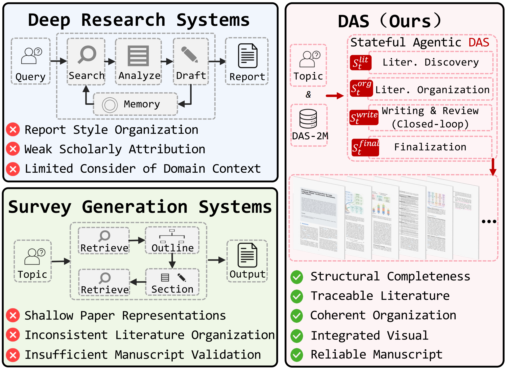
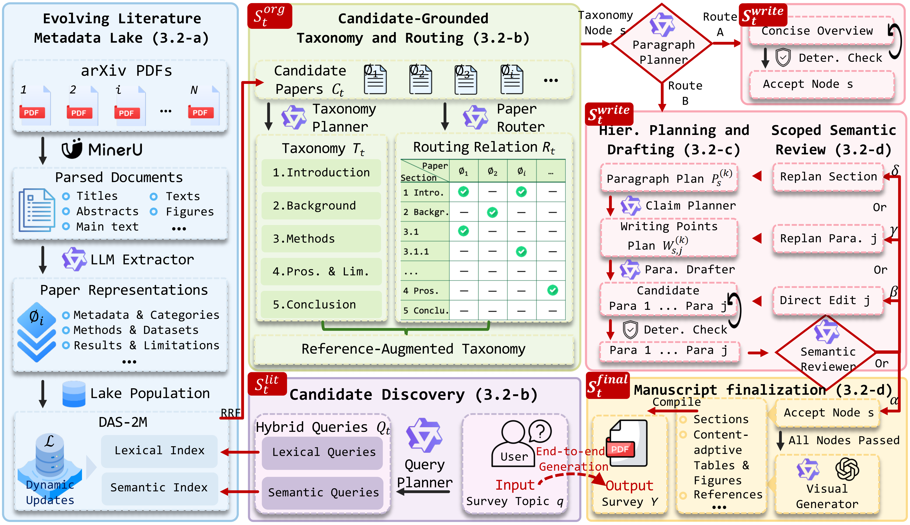
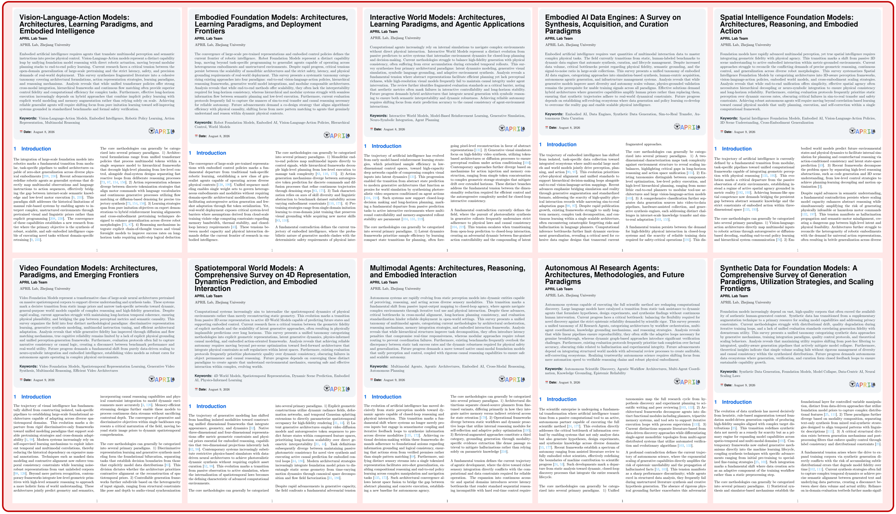

<div align="center">


[Zhikai Xu](https://github.com/ZhikaiXu24)<sup>1,&#42;</sup> · [Zhucun Xue](https://scholar.google.com/citations?hl=zh-CN&user=m3KDreEAAAAJ)<sup>1,&#42;</sup> · [Teng Hu](https://sjtuplayer.github.io/)<sup>2</sup> · [Yabiao Wang](https://scholar.google.com.hk/citations?hl=zh-CN&user=xiK4nFUAAAAJ)<sup>1</sup> · [Yong Liu](https://scholar.google.com/citations?user=qYcgBbEAAAAJ)<sup>1</sup> · [Jiangning Zhang](https://zhangzjn.github.io/)<sup>1,&#9993;</sup>

<sup>1</sup>Zhejiang University &nbsp;&nbsp; <sup>2</sup>Shanghai Jiao Tong University<br />
<sup>&#42;</sup>Equal contribution &nbsp;&nbsp; <sup>&#9993;</sup>Corresponding author

<a href="https://arxiv.org/abs/2608.18034"></a>
<a href="https://huggingface.co/datasets/ZhikaiXu24/DAS-2M"></a>
<a href="https://huggingface.co/datasets/ZhikaiXu24/DAS-Bench"></a>
<a href="https://zhikaixu24.github.io/projects/DAS/"></a>

[Overview](#-overview) · [Release](#-release) · [DAS-Method](#-das-method) · [DAS-2M](#-das-2m) · [Surveys by DAS](#-surveys-by-das) · [DAS-Bench](#-das-bench) · [Installation](#-installation) · [Citation](#-citation)


</div>

## 🔥 Continuous Updates

- ✅ **[2026-08-20]** DAS-Bench was released on Hugging Face.
- ✅ **[2026-08-14]** 220 surveys generated by DAS were released.
- ✅ **[2026-08-08]** DAS-2M was released.
- ✅ **[2026-08-08]** DAS-Bench and its evaluation toolkit were released.
- ⏳ **DAS method code:** To be released.
- ⏳ **Additional source support:** To be released (web pages, technical reports, perspectives, and other sources).

The paper is available on [arXiv](https://arxiv.org/abs/2608.18034).

## 🔭 Overview

**Deep Academic Survey (DAS)** is the first framework for **publication-oriented academic survey generation**, designed to construct survey manuscripts with **structural completeness, traceable literature support, coherent organization across taxonomy, section, and paragraph levels, integrated visual elements, and consistency among final manuscript artifacts**. To achieve this, DAS formulates survey generation as **stateful manuscript construction**, separating reusable paper understanding maintained in a dynamically updated literature metadata lake from topic-specific **organization, drafting, review, and finalization**.

<p align="center">
  <a href="assets/teaser.pdf">
    
  </a>
</p>

## ✨ Highlights

- **DAS:** A stateful agentic framework for **publication-oriented academic survey generation**, connecting literature discovery, organization, citation-grounded writing, closed-loop review, and manuscript finalization in one end-to-end workflow.
- **DAS-2M:** A persistent and dynamically updated literature metadata lake that provides reusable, **survey-oriented representations** of approximately **2 million papers**.
- **DAS-Bench:** A **30-topic multi-domain benchmark** for academic survey generation, paired with **DAS-Eval**, a 16-criterion evaluation suite designed specifically for **publication-oriented academic surveys**, covering scholarly citation, taxonomic synthesis, hierarchical discourse, and manuscript reliability.

## 📦 Release

| Component | Status | Contents |
|---|---|---|
| DAS-Bench ([GitHub](DAS-Bench/) · [Hugging Face](https://huggingface.co/datasets/ZhikaiXu24/DAS-Bench)) | ✅ Released | Benchmark specification, loadable topics and results, evaluation code, and qualitative materials. |
| [DAS-2M](https://huggingface.co/datasets/ZhikaiXu24/DAS-2M) | ✅ Released | Persistent and dynamically updated literature metadata lake distributed through Hugging Face. |
| [Surveys by DAS](examples/) | ✅ Released | 220 surveys generated by DAS were released. |
| [`DAS/`](DAS/) | ⏳ To be released | Core DAS method implementation and generation pipeline. |
| Additional source support | ⏳ To be released | Support for web pages, technical reports, perspectives, and other non-paper sources. |

## 🧭 DAS-Method

**DAS performs stateful agentic construction over a shared manuscript state**, coordinating literature discovery, candidate-grounded literature organization, hierarchical planning and drafting, scoped semantic review and repair, and manuscript finalization. When review identifies a defect, DAS reactivates only the affected writing states and re-executes the dependent agentic steps, forming a **scoped agentic review-and-repair loop**.

<p align="center">
  <a href="assets/method.pdf">
    
  </a>
</p>

1. **Evolving literature metadata lake:** Full papers are parsed and converted by an LLM-based extractor into reusable **survey-oriented paper representations**. Lexical and semantic indexes over these representations support hybrid candidate discovery, while dynamic updates allow DAS to incorporate newly available literature.
2. **Candidate-grounded taxonomy and routing:** The **Query Planner agent** generates complementary lexical and semantic queries to discover candidate papers. The **Taxonomy Planner agent** organizes their structured representations into a candidate-grounded taxonomy, and the **Paper Router agent** performs reverse paper-to-section routing to establish section-level citation scopes for subsequent drafting.
3. **Hierarchical planning and drafting:** For each taxonomy node, the **Paragraph Planner agent** constructs paragraph plans with paragraph-level paper assignments. The **Claim Planner agent** further organizes each paragraph into writing points with intended claims, supporting citation groups, and technical details, after which the **Drafter agent** generates paragraph candidates that must pass **deterministic validation** before entering the shared writing state.
4. **Scoped semantic review and manuscript finalization:** The **Reviewer agent** evaluates each assembled subsection and adaptively selects among acceptance, direct paragraph revision, paragraph replanning, or subsection replanning. The affected writing state is repaired, reassembled, and evaluated again, forming a **scoped agentic review-and-repair loop** that continues until acceptance or the retry budget is exhausted. Accepted content then enters finalization, where content-adaptive figures and tables, bibliographic records, cross-references, LaTeX, BibTeX, and assets are assembled into the final survey manuscript.

## 🌊 DAS-2M

DAS-2M is a persistent and dynamically updated literature metadata lake containing reusable, survey-oriented representations of approximately 2 million arXiv papers submitted between January 2020 and June 2026. Each representation is organized into eight high-level field groups: bibliographic metadata, topical categorization, technical configuration, resource availability, methodological details, dataset usage, research rationale and findings, and empirical evaluation and limitations. Lexical and semantic indexes over the extracted metadata support hybrid candidate discovery, while the same processing pipeline dynamically incorporates newly available papers.

DAS-2M is publicly available on 🤗 [Hugging Face](https://huggingface.co/datasets/ZhikaiXu24/DAS-2M).

## 📚 Surveys by DAS

DAS has released **220 complete survey manuscripts** across ten research directions. Select a direction to browse its concise survey subtopics, then click a subtopic to open the corresponding PDF directly on GitHub.

<p align="center">
  <a href="examples/das_github.pdf">
    
  </a>
</p>

<table>
  <tr>
    <td width="20%" align="center" valign="middle"><a href="examples/1_Foundation%20Model/README.md"><strong>📁 Foundation Model</strong></a><br /><sub>001-020</sub></td>
    <td width="20%" align="center" valign="middle"><a href="examples/2_Vision%20Foundation%20Model/README.md"><strong>📁 Vision Foundation Model</strong></a><br /><sub>021-045</sub></td>
    <td width="20%" align="center" valign="middle"><a href="examples/3_Multimodal%20Large%20Models/README.md"><strong>📁 Multimodal Large Models</strong></a><br /><sub>046-075</sub></td>
    <td width="20%" align="center" valign="middle"><a href="examples/4_Generative%20AI/README.md"><strong>📁 Generative AI / Diffusion / Video Generation</strong></a><br /><sub>076-100</sub></td>
    <td width="20%" align="center" valign="middle"><a href="examples/5_3D%20Spatial%20Intelligence/README.md"><strong>📁 3D / Spatial Intelligence</strong></a><br /><sub>101-125</sub></td>
  </tr>
  <tr>
    <td width="20%" align="center" valign="middle"><a href="examples/6_Embodied%20AI%20Robotics/README.md"><strong>📁 Embodied AI / Robotics</strong></a><br /><sub>126-160</sub></td>
    <td width="20%" align="center" valign="middle"><a href="examples/7_AI%20Agent%20Reasoning/README.md"><strong>📁 AI Agent / Reasoning</strong></a><br /><sub>161-180</sub></td>
    <td width="20%" align="center" valign="middle"><a href="examples/8_Data-centric%20AI/README.md"><strong>📁 Data-centric AI</strong></a><br /><sub>181-195</sub></td>
    <td width="20%" align="center" valign="middle"><a href="examples/9_Emerging%20Cross-disciplinary%20Topics/README.md"><strong>📁 Emerging Cross-disciplinary Topics</strong></a><br /><sub>196-200</sub></td>
    <td width="20%" align="center" valign="middle"><a href="examples/TOP_Popularity/README.md"><strong>📁 Top 20 High-Potential Topics</strong></a><br /><sub>201-220</sub></td>
  </tr>
</table>

The PDFs are tracked with Git LFS and excluded from default LFS fetches. To download all survey PDFs after cloning, run:

```bash
git lfs pull --include="examples/**" --exclude=""
```

## 📊 DAS-Bench

DAS-Bench is available on 🤗 [Hugging Face](https://huggingface.co/datasets/ZhikaiXu24/DAS-Bench), with directly loadable configurations for the frozen topics, full 30-topic results, and matched 21-topic CS results.

DAS-Bench contains 30 survey topics, comprising 21 core computer science topics and nine non-CS topics. DAS-Eval evaluates publication-oriented academic surveys along four dimensions, each containing four criteria scored from 1 to 5:

- **BSC — Balanced Scholarly Citation Quality:** citation grounding and distribution.
- **TSQ — Taxonomic Synthesis Quality:** literature coverage and global organization.
- **HDQ — Hierarchical Discourse Quality:** argumentation across sections and paragraphs.
- **MAR — Manuscript Assembly Reliability:** reference integrity, visual integration, layout, and component completeness.

The overall score is the mean of all 16 criteria. Multimodal LLM judges evaluate rendered manuscripts together with structured citation metadata, while domain experts independently rank method-blinded manuscripts.

### Main comparison

| Method | BSC Avg. ↑ | TSQ Avg. ↑ | HDQ Avg. ↑ | MAR Avg. ↑ | Total Avg. ↑ |
|---|---:|---:|---:|---:|---:|
| Human | 3.84 | 4.29 | 4.24 | 5.00 | 4.34 |
| Codex | 2.80 | 2.99 | 2.75 | 4.19 | 3.18 |
| GPT Deep Research | 3.32 | 3.48 | 3.76 | 4.14 | 3.68 |
| Gemini Deep Research | 2.95 | 3.82 | 4.07 | 4.84 | 3.92 |
| Naive RAG | 3.73 | 4.06 | 4.22 | 4.09 | 4.03 |
| AutoSurvey | 3.81 | 3.74 | 3.69 | 3.67 | 3.73 |
| SurveyForge | 3.73 | 3.81 | 3.74 | 3.83 | 3.78 |
| LiRA | 3.63 | 3.72 | 4.06 | 3.07 | 3.62 |
| InteractiveSurvey | 2.75 | 3.88 | 3.93 | 4.68 | 3.81 |
| **DAS** | **3.85** | **4.22** | **4.28** | **5.00** | **4.34** |

Among the systems evaluated on all 30 topics, **DAS achieves the highest group averages in BSC, TSQ, HDQ, and MAR**, yielding a Total Avg. of **4.34**, compared with **4.03** for Naive RAG. AutoSurvey and SurveyForge are evaluated on the 21 CS topics supported by their original corpora, whereas the remaining completed systems are evaluated on all 30 topics. The Human row contains one publicly available academic survey matched to each DAS-Bench topic and is reported for reference only.

For comparison under identical topic coverage, see the existing [DAS-Bench documentation](DAS-Bench/) for the matched 21-topic CS comparison, criterion-level CSV files, complete metric definitions, and evaluation protocol.

### Capability comparison

The following comparison summarizes DAS and representative automated survey generation systems in terms of their documented capabilities.

| System | Corpus | PRep | GTax | LRoute | DPlan | RLoop | DCheck | VInt | CAVis | PDF |
|---|---|:---:|:---:|:---:|:---:|:---:|:---:|:---:|:---:|:---:|
| AutoSurvey | 530K | × | × | × | × | × | × | × | × | × |
| SurveyForge | 600K + 20K | × | × | × | × | × | × | × | × | × |
| SurveyX | 2.63M* + online | × | ✓ | × | × | × | × | ✓ | × | ✓ |
| InteractiveSurvey | online + uploads | × | ✓ | × | × | × | × | ✓ | × | ✓ |
| LiRA | provided references | × | × | × | × | ✓ | × | × | × | × |
| DeepSurvey | online | × | ✓ | ✓ | × | ✓ | × | × | × | × |
| **DAS** | **2M** | ✓ | ✓ | ✓ | ✓ | ✓ | ✓ | ✓ | ✓ | ✓ |

A check mark denotes an explicitly documented capability; a cross denotes an absent or undocumented capability. *SurveyX reports an unreleased 2.63M-paper corpus. Definitions and sources are provided in the [benchmark documentation](DAS-Bench/README.md#system-capability-comparison).

### Qualitative manuscript comparison

Representative first-page and interior-page views from Codex, GPT Deep Research, AutoSurvey, InteractiveSurvey, and DAS illustrate manuscript-level differences that are not fully captured by aggregate scores. Across the displayed baseline examples, the annotations identify citation stacking, repeated citation bundles, coarse claim-to-reference attribution, duplicated headings, unsupported historical or capability statements, and weak coupling between figures, equations, and the surrounding discussion. For the same topic, the DAS example maintains closer alignment among the taxonomy, section-level organization, claim-level citations, mathematical formulations, content-adaptive visualizations, and structured comparisons across papers.

<p align="center">
  <a href="DAS-Bench/assets/qualitative_case_study.pdf">
    
  </a>
</p>

For complete generated manuscripts and additional qualitative comparisons, see the [project page](https://zhikaixu24.github.io/projects/DAS/).

### Additional experimental evidence

| Evidence | Result |
|---|---|
| **Core ablations** | Reverse paper-to-section routing and semantic review provide the most consistent gains across DAS-Eval dimensions. Full DAS compiles all **30/30** manuscripts, compared with **27/30** without deterministic validation. |
| **Scoped review and repair** | The full adaptive repair policy achieves a **74.59% Review Pass Rate** with an average review-and-repair cost of **0.79M tokens per survey**, balancing review success and repair cost by matching the repair scope to the detected defect. |
| **Expert evaluation** | Under majority voting, DAS is preferred to Naive RAG on **27/30 topics** and to AutoSurvey on **19/21 shared CS topics**, ranking first on **18/21** of these shared topics. |

Full ablation results, repair-policy analysis, backbone sensitivity experiments, and judge-robustness results are provided in the paper and accompanying [DAS-Bench documentation](DAS-Bench/).

## 🔨 Installation

The current public release provides DAS-Bench and its evaluation toolkit. The DAS generation method remains marked **To be released**.

```bash
git clone https://github.com/ZhikaiXu24/DAS.git
cd DAS/DAS-Bench
python -m pip install -r requirements.txt
```

Place generated survey PDFs under `eval_inputs/<method>/<topic_id>.pdf`, configure the OpenAI-compatible judges in `config.json`, and export credentials through environment variables. Never write API keys into committed files.

For a one-topic evaluation:

```bash
export OPENAI_API_KEY="your_api_key"
export PDF_EXTRACT_KIT_ROOT="/path/to/PDF-Extract-Kit"

bash evaluation/run_eval_all.sh \
  --method submission \
  --topic-id 001 \
  --bsc-api-mode on \
  --mar-api-mode on \
  --tsq-hdq-api-mode on
```

See [`DAS-Bench/README.md`](DAS-Bench/README.md) for input conventions, judge configuration, metric definitions, and complete evaluation instructions.

## ✒️ Citation

If DAS, DAS-2M, or DAS-Bench is useful for your research, please consider citing:

```bibtex
@article{xu2026deepacademicsurvey,
  title   = {Deep Academic Survey: Stateful Agentic Closed-Loop Paradigm for Academic Survey Automation},
  author  = {Xu, Zhikai and Xue, Zhucun and Hu, Teng and Wang, Yabiao and Liu, Yong and Zhang, Jiangning},
  journal = {arXiv preprint},
  year    = {2026}
}
```

## 📄 License

The code and documentation in this repository are released under the [Apache License 2.0](LICENSE). DAS-2M is distributed separately and is subject to the terms published on its Hugging Face dataset page.

## ✉️ Contact

```text
zhikai.xu24@zju.edu.cn
```

```text
186368@zju.edu.cn
```
