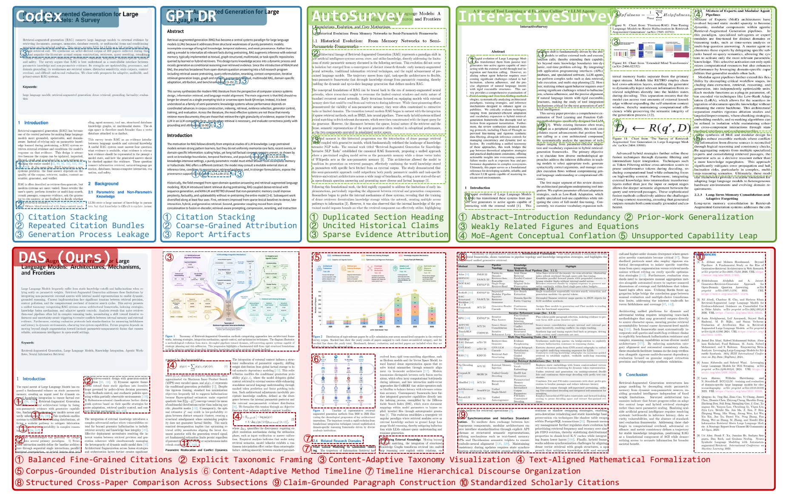

# DAS-Bench

This repository releases the data specification and evaluation protocol for DAS-Bench, a benchmark of automatically generated academic surveys.

The current release includes the benchmark specification and evaluator implementation. It does not include survey-generation code, submission-format documentation, private experiment artifacts, or model outputs.

## Benchmark task

Each benchmark instance provides a research topic and a fixed pool of 300 candidate-paper metadata records. The benchmark contains 30 topics spanning language models, computer vision, robotics, scientific discovery, security, medicine, climate, remote sensing, finance, and uncertainty estimation.

The frozen topic list is available in `benchmark/topics.json`. Detailed task boundaries are documented in `benchmark/task_specification.md`.

## Evaluation dimensions

The benchmark defines four complementary metric families:

- Balanced Scholarly Citation Quality (BSC)
- Manuscript Artifact Reliability (MAR)
- Taxonomic Synthesis Quality (TSQ)
- Hierarchical Drafting Quality (HDQ)

Each family contains four dimensions scored from 1 to 5. The benchmark reports the four family averages and a transparent Total Avg., which is the arithmetic mean of all 16 dimensions. See `benchmark/evaluation_protocol.md` for the metric definitions and aggregation rules.

## Benchmark results

All values use a 1--5 scale, and higher is better. Human performance is provided only as a reference and is excluded from system ranking. The complete criterion-level results are available in [`results/main_results_30_topics.csv`](results/main_results_30_topics.csv).

### Full benchmark: 30 topics

| Method | BSC Avg. | TSQ Avg. | HDQ Avg. | MAR Avg. | Total Avg. |
|---|---:|---:|---:|---:|---:|
| Human | 3.84 | 4.29 | 4.24 | 5.00 | 4.34 |
| Codex | 2.80 | 2.99 | 2.75 | 4.19 | 3.18 |
| GPT Deep Research | 3.32 | 3.48 | 3.76 | 4.14 | 3.68 |
| Gemini Deep Research | 2.95 | 3.82 | 4.07 | 4.84 | 3.92 |
| Naive RAG | 3.73 | 4.06 | 4.22 | 4.09 | 4.03 |
| AutoSurvey | 3.81 | 3.74 | 3.69 | 3.67 | 3.73 |
| SurveyForge | 3.73 | 3.81 | 3.74 | 3.83 | 3.78 |
| LiRA | 3.63 | 3.72 | 4.06 | 3.07 | 3.62 |
| InteractiveSurvey | 2.75 | 3.88 | 3.93 | 4.68 | 3.81 |
| DAS | **3.85** | **4.22** | **4.28** | **5.00** | **4.34** |

Group averages are the arithmetic means of their four dimensions. Total Avg. is the arithmetic mean of all 16 dimensions, equivalently the mean of the four group averages before display rounding.

### Matched CS subset: 21 topics

This subset contains the 21 computer science topics shared by every evaluated system. It provides a matched comparison under identical topic coverage; it is not a separate benchmark split. The CSV reports the same 16 criteria and aggregation convention as the 30-topic main result: [`results/main_results_cs21.csv`](results/main_results_cs21.csv).

| Method | BSC Avg. | TSQ Avg. | HDQ Avg. | MAR Avg. | Total Avg. |
|---|---:|---:|---:|---:|---:|
| Human | 3.89 | 4.37 | 4.27 | 5.00 | 4.38 |
| Codex | 2.79 | 2.99 | 2.75 | 4.20 | 3.18 |
| GPT Deep Research | 3.40 | 3.51 | 3.80 | 4.14 | 3.71 |
| Gemini Deep Research | 3.06 | 3.82 | 4.05 | 4.77 | 3.93 |
| Naive RAG | 3.67 | 4.00 | 4.11 | 4.07 | 3.96 |
| AutoSurvey | 3.81 | 3.74 | 3.69 | 3.67 | 3.73 |
| SurveyForge | 3.73 | 3.81 | 3.74 | 3.83 | 3.78 |
| LiRA | 3.63 | 3.70 | 4.05 | 3.04 | 3.60 |
| InteractiveSurvey | 2.82 | 3.90 | 3.94 | 4.79 | 3.86 |
| DAS | **3.87** | **4.18** | **4.25** | **5.00** | **4.32** |

## Compared systems

The following tables link to the official papers, product pages, source repositories, and datasets associated with the evaluated systems. A dash indicates that the corresponding resource is not publicly available.

### General

| Method | Reference | Code | Datasets | Resources |
|---|---|---|---|---|
| Naive RAG | [Lewis et al. (2020)](https://arxiv.org/abs/2005.11401) | — | — | — |
| Gemini Deep Research | [Official product page](https://blog.google/products-and-platforms/products/gemini/google-gemini-deep-research/) | — | — | — |
| GPT Deep Research | [Official product page](https://openai.com/index/introducing-deep-research/) | — | — | — |
| Codex | [Official product page](https://openai.com/codex/get-started/) | [openai/codex](https://github.com/openai/codex) | — | — |

### Auto Survey Generation

| Method | Reference | Code | Datasets | Resources |
|---|---|---|---|---|
| AutoSurvey | [Wang et al. (2024)](https://arxiv.org/abs/2406.10252) | [AutoSurveys/AutoSurvey](https://github.com/AutoSurveys/AutoSurvey) | [Paper database](https://1drv.ms/u/c/8761b6d10f143944/EaqWZ4_YMLJIjGsEB_qtoHsBoExJ8bdppyBc1uxgijfZBw?e=2EIzti) | — |
| SurveyForge | [Yan et al. (2025)](https://aclanthology.org/2025.acl-long.609/) | [InternScience/SurveyForge](https://github.com/InternScience/SurveyForge) | [SurveyBench](https://huggingface.co/datasets/InternScience/SurveyBench) · [Paper database](https://huggingface.co/datasets/InternScience/SurveyForge_database) | — |
| SurveyX | [Liang et al. (2025)](https://arxiv.org/abs/2502.14776) | [IAAR-Shanghai/SurveyX](https://github.com/IAAR-Shanghai/SurveyX) | — | [Generated examples](https://www.surveyx.cn/) |
| InteractiveSurvey | [Wen et al. (2025)](https://arxiv.org/abs/2504.08762) | [TechnicolorGUO/InteractiveSurvey](https://github.com/TechnicolorGUO/InteractiveSurvey) | — | — |

## System capability comparison

The comparison below records capabilities explicitly documented in the corresponding papers or public implementations.

| System | Corpus | PRep | GTax | LRoute | DPlan | RLoop | DCheck | VInt | CAVis | PDF |
|---|---|:---:|:---:|:---:|:---:|:---:|:---:|:---:|:---:|:---:|
| AutoSurvey | 530K | × | × | × | × | × | × | × | × | × |
| SurveyForge | 600K + 20K | × | × | × | × | × | × | × | × | × |
| SurveyX | 2.63M* + online | × | ✓ | × | × | × | × | ✓ | × | ✓ |
| InteractiveSurvey | online + uploads | × | ✓ | × | × | × | × | ✓ | × | ✓ |
| LiRA | provided references | × | × | × | × | ✓ | × | × | × | × |
| DeepSurvey | online | × | ✓ | ✓ | × | ✓ | × | × | × | × |
| **DAS** | **2M** | ✓ | ✓ | ✓ | ✓ | ✓ | ✓ | ✓ | ✓ | ✓ |

A check mark denotes an explicitly documented capability; a cross denotes an absent or undocumented capability. *SurveyX reports an unreleased 2.63M-paper corpus.

**Legend.** PRep: pre-run structured paper representation; GTax: candidate-literature-aware taxonomy planning; LRoute: LLM-based section-support routing; DPlan: paragraph and claim/citation planning before prose; RLoop: review decisions can trigger regeneration; DCheck: deterministic validation beyond LLM critique; VInt: in-text insertion and verification of visual references; CAVis: content-adaptive visualizations; PDF: automatic compiled-manuscript production.

## Qualitative case study

Representative first and interior pages from Codex, GPT Deep Research, AutoSurvey, InteractiveSurvey, and DAS provide a manuscript-level complement to the aggregate benchmark results.

[Download the original PDF](assets/qualitative_case_study.pdf)



## Topics and metadata

The paper metadata will be distributed separately through Hugging Face and is intentionally not duplicated in this Git repository. The public metadata schema is provided in `benchmark/metadata_schema.json`; dataset provenance and download instructions will be added to `data/README.md` when the dataset release is approved.

## Evaluation code

The `evaluation/` directory provides the four benchmark evaluators and the PDF preprocessing entry point:

- `eval_prepare.py`: prepares Markdown and rendered page images from survey PDFs;
- `eval_bsc.py`: evaluates Balanced Scholarly Citation Quality;
- `eval_mar.py`: evaluates Manuscript Artifact Reliability;
- `eval_tsq_hdq.py`: evaluates Taxonomic Synthesis Quality and Hierarchical Drafting Quality; and
- `run_eval_all.sh`: runs the evaluation stages serially.

Use Python 3.10 or newer and install the common dependencies:

```bash
python -m pip install -r requirements.txt
```

Configure the hosted or local OpenAI-compatible judge in `config.json`, then export the required credentials directly in the shell. Use `OPENAI_API_KEY` for the hosted judge and `LOCAL_LLM_API_KEY` only when the local endpoint requires authentication. API credentials must never be committed.

PDF preprocessing uses MinerU to reproduce the benchmark's Markdown extraction. Install MinerU separately and set `PDF_EXTRACT_KIT_ROOT` before running `eval_prepare.py`. All evaluator paths are resolved relative to the repository root.

## Current release scope

This staged release includes:

- the frozen 30-topic list;
- the benchmark task definition;
- BSC, MAR, TSQ, and HDQ metric definitions;
- the public metadata schema; and
- metadata release notes;
- the BSC, MAR, TSQ, and HDQ evaluator implementations; and
- a safe placeholder configuration and dependency list.

The survey-generation system and formal submission-format documentation remain private and may be considered for a later version.

## License and citation

The license and citation entry will be added after release approval. Until a license is added, the repository contents should not be treated as granting reuse rights.
